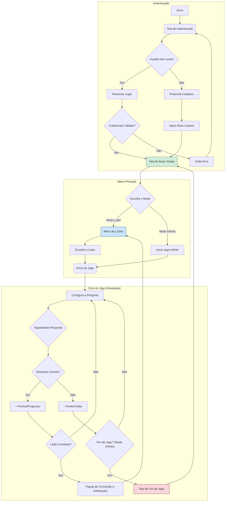

# Jogo Educacional para Disciplina de Sinais e Sistemas Lineares 


## Introdução

Este projeto, desenvolvido sob orientação da professora Thabatta, docente da disciplina de **Sinais e Sistemas Lineares** no Centro Federal de Educação Tecnológica de Minas Gerais (CEFET-MG), tem como objetivo a criação de um **jogo educacional** voltado para o apoio ao ensino e à aprendizagem dos principais conceitos da disciplina.

Por meio da **gamificação**, busca-se promover um maior engajamento dos estudantes e facilitar a assimilação de conteúdos fundamentais, tais como **resposta ao impulso**, **convolução**, **estabilidade** e **análise de sistemas lineares invariantes no tempo (LTI)**. A proposta visa aliar a interatividade dos jogos ao rigor conceitual, proporcionando uma ferramenta didática complementar e inovadora no contexto do aprendizado em engenharia.

---

## Documentação de Execução e Estrutura do Projeto

### Como Executar o Projeto

Para executar o jogo educacional desenvolvido na disciplina de **Sinais e Sistemas Lineares**, siga os passos abaixo:

#### 1. Clonando o Repositório

Certifique-se de ter o Git instalado. Em seguida, abra o terminal e execute:

```bash
git clone https://github.com/Jottynha/TRABALHO-SSL.git
````

#### 2. Acessando o Diretório

Entre na pasta do projeto:

```bash
cd TRABALHO-SSL
```

#### 3. Executando o Jogo

Como se trata de um projeto Web estático (HTML, CSS e JavaScript), você pode executá-lo de duas formas:

##### **Opção 1: Abrir diretamente no navegador**

* Localize o arquivo `index.html` na pasta raiz.
* Dê um duplo clique ou abra-o com o navegador de sua preferência.

##### **Opção 2: Usar um servidor local (recomendado)**

Para garantir que todos os recursos funcionem corretamente (especialmente os sons), utilize um servidor local:

###### Usando Python 3:

```bash
# Dentro da pasta do projeto
python -m http.server 8000
```

Depois, abra o navegador e acesse:

```
http://localhost:8000
```

---

### Requisitos

* Navegador moderno (Chrome, Firefox, Edge, etc.)
* (Opcional) Python 3, caso queira executar via servidor local

---

### Observações

* O jogo foi projetado para ser uma ferramenta complementar no ensino de conceitos como **resposta ao impulso**, **convolução**, **estabilidade** e **análise de sistemas LTI**.
* A interface é intuitiva e interativa, projetada para promover o aprendizado por meio da gamificação.

---

Caso tenha dúvidas ou queira contribuir com o projeto, acesse o repositório oficial no GitHub:
🔗 [https://github.com/Jottynha/TRABALHO-SSL](https://github.com/Jottynha/TRABALHO-SSL)

---

## Fluxograma da Aplicação

O diagrama abaixo representa o fluxo completo de funcionamento da aplicação, dividido em três grandes blocos: **Autenticação**, **Menu Principal** e **Ciclo do Jogo (Gameplay)**. Esse fluxograma ajuda a entender como o usuário interage com o sistema desde o login até o fim de uma sessão de jogo.

* O usuário inicia autenticando-se no sistema (com login ou cadastro).
* Após o login bem-sucedido, escolhe entre o **Modo de Lição** ou **Modo Infinito**.
* O ciclo de jogo segue com perguntas, validações de resposta e verificação de progresso ou término da sessão.


---


### Estrutura do Projeto

A tabela a seguir apresenta os principais arquivos e diretórios que compõem o projeto, bem como uma breve descrição de suas funções:

| Arquivo / Pasta    | Descrição                                                                 |
|--------------------|---------------------------------------------------------------------------|
| [`index.html`](#index-html) | Página principal do projeto. Contém a estrutura básica do jogo em HTML.   |
| [`style.css`](#style-css)        | Folha de estilos responsável pelo layout e visual do jogo.                |
| `js/`              | Diretório que contém todos os scripts JavaScript utilizados no projeto.   |
| [`js/audio.js`](#audio-js)      | Gerencia os efeitos sonoros e sons do jogo.                              |
| [`js/drawing.js`](#drawing-js)   | Responsável pelas funções de desenho na tela (canvas, elementos gráficos).|
| [`js/main.js`](#main-js)       | Script principal. Controla o fluxo geral do jogo e a inicialização.       |
| [`js/questions.js`](#questions-js)  | Contém as perguntas e lógicas relacionadas aos desafios propostos.        |
| [`js/ui.js`](#ui-js)         | Gerencia a interface do usuário, como botões e telas interativas.         |

---

<h3 id="index-html">📄 Estrutura do Arquivo HTML (`index.html`)</h3>

O arquivo `index.html` é a base da interface gráfica do projeto **Ritmo dos Sinais**. Ele define a estrutura e os elementos visuais apresentados ao usuário, desde a tela de autenticação até o ambiente interativo das lições. A seguir, descrevemos sua composição e funcionalidade:

#### 1. **Cabeçalho (`<head>`)**

No início do documento, temos:

* `<!DOCTYPE html>`: Define o tipo do documento como HTML5.
* `<html lang="pt">`: Indica que o conteúdo da página está em português.
* `<meta charset="UTF-8" />`: Define a codificação dos caracteres como UTF-8.
* `<meta name="viewport" content="width=device-width, initial-scale=1" />`: Torna a interface responsiva em dispositivos móveis.
* `<title>Ritmo dos Sinais</title>`: Define o título exibido na aba do navegador.
* Inclusão de fontes e estilos:

  * `Poppins` via Google Fonts.
  * `style.css`: arquivo CSS externo responsável pela estilização geral.
  * `SweetAlert2`: biblioteca para exibição de alertas e mensagens amigáveis.

#### 2. **Tela de Autenticação**

```html
<div id="auth-screen" class="card">
```

Essa `div` representa a tela inicial, onde o usuário pode:

* Inserir nome de usuário e senha.
* Alternar entre **Login** e **Criar Conta**.
* Visualizar mensagens de erro, caso ocorra falha na autenticação.

#### 3. **Tela de Boas-Vindas**

```html
<div id="welcome-screen">
```

Após o login, o usuário é recepcionado com uma breve explicação sobre o jogo e duas opções:

* **Modo Lição**: aprendizado progressivo.
* **Modo Infinito**: desafios contínuos.

#### 4. **Interface Principal**

```html
<div class="flex-container">
```

Esse bloco contém os principais elementos do jogo:

* **Menu de Lições** (`#menu-screen`): botões para selecionar lições. Apenas a Lição 1 e a Lição 9 estão habilitadas inicialmente.
* **Tela de Jogo** (`#game-screen`): exibe a lição atual, pergunta, botão para ouvir o som, canvas com a onda sonora e as opções de resposta.
* **Painel Lateral**:

  * `#info-card`: mostra detalhes adicionais sobre o conteúdo após acertos.
  * `#highscore-card`: exibe a maior pontuação.
  * `#completed-lessons-card`: lista as lições finalizadas.
  * `#tips`: dicas educacionais.
  * `#btn-info`: botão que abre o modal com **Informações do Projeto**.
  * `#btn-settings`: botão de **Configurações** para redefinir pontuações.

#### 5. **Modais**

Dois modais principais são implementados:

* **Informações do Projeto**: lista os membros da equipe, e-mail de contato e link para o repositório.
* **Configurações**: oferece a opção de apagar os scores salvos.

#### 6. **Outros Elementos**

* `#score-container`: mostra a pontuação atual e vidas restantes.
* `#toggle-dark`: botão para alternar o modo claro/escuro (ícone de lua).
* `#progress-bar`: barra de progresso visual.
* `#tooltip`: dica flutuante exibida em determinadas interações.
* `#overlay`: camada para bloquear interações durante transições/modais.

#### 7. **Importação de Scripts**

```html
<script type="module" src="js/main.js"></script>
```

Carrega o script principal JavaScript (`main.js`), que contém toda a lógica de funcionamento da aplicação, como:

* Login e criação de contas.
* Navegação entre as telas.
* Geração das perguntas e ondas.
* Lógica dos modos de jogo.

---

<h3 id="style-css">📄 Estrutura do Arquivo CSS (`style.css`)</h3>

O arquivo `style.css` é responsável por toda a estilização visual do projeto, definindo cores, espaçamentos, fontes, organização de layout e aparência dinâmica. A seguir, destacamos as principais áreas de estilização e suas funções:

#### 1. **Estilos básicos globais**

```css
html, body {
  height: 200%;
  margin: 0;
  padding: 0;
  overflow-y: scroll;
  overflow-x: scroll;
}
```

Define altura total da página, remove margens e ativa rolagem nos eixos horizontal e vertical.

```css
* {
  box-sizing: border-box;
  margin: 0;
  padding: 0;
}
```

Aplica o modelo `box-sizing: border-box` universalmente e remove margens/padding padrão dos navegadores.

#### 2. **Cores e variáveis**

```css
:root {
  --primary-green: #2AA64F;
  --dark-green: #1F8A3D;
  --light-bg: #F7F9FA;
  --dark-bg: #2E2E2E;
  --text-dark: #333;
  --text-light: #000000;
  --white: #FFF;
  --card-bg: #FFF;
  --card-dark: #3A3A3A;
  --shadow: rgba(0, 0, 0, 0.1);
}
```

Declara variáveis CSS reutilizáveis que centralizam o controle de cores e estilos, facilitando a manutenção e o modo escuro.

#### 3. **Modo Claro e Escuro**

```css
body {
  background: var(--light-bg);
  color: var(--text-dark);
}
body.dark-mode {
  background: var(--dark-bg);
  color: var(--text-light);
}
```

Altera as cores do fundo e texto dinamicamente dependendo se o modo escuro está ativado (`dark-mode` é uma classe adicionada ao `body`).

#### 4. **Elementos da interface do jogo**

* `#auth-screen`, `#welcome-screen`, `.flex-container`, `#score-container`: controlam a exibição das telas iniciais e do jogo.
* `.btn`, `.btn-primary`, `.btn-option`: estilos para botões com efeitos de hover e clique.
* `#score-container`, `.score-number`: mostra e anima a pontuação do jogador.

#### 5. **Cards informativos**

```css
.card, #highscore-card, #completed-lessons-card {
  background: var(--card-bg);
  border-radius: 12px;
  box-shadow: 0 4px 12px var(--shadow);
}
```

Define a aparência dos cards que mostram pontuações, progresso e lições concluídas, com cantos arredondados e sombras.

#### 6. **Modal e overlays**

* `.modal`: janelas modais flutuantes para mostrar mensagens ou interações extras.
* `.overlay.success`, `.overlay.error`: coberturas transparentes para indicar visualmente o sucesso ou erro de uma ação.


#### 7. **Barra de progresso**

```css
.progress-container {
  position: fixed;
  bottom: 20px;
  left: 50%;
  transform: translateX(-50%);
  ...
}
```

Define uma barra fixa no rodapé que exibe o progresso do usuário durante as atividades.


#### 8. **Outros detalhes**

* `.lesson-difficulty`: indica o nível de dificuldade das lições com estilo itálico e cor discreta.
* `.toggle`: botão de alternância para mudar o tema claro/escuro.
* `.close`: botão de fechar janelas modais.

---

<h3 id="audio-js">📄 Estrutura do Arquivo JS (`audio.js`)</h3>

O arquivo `audio.js` é responsável por toda a manipulação de sons do projeto. Ele implementa a criação de contexto de áudio, emissão de diferentes tipos de sons para cada lição, e efeitos sonoros de feedback (como sucesso ou erro). Utiliza a API Web Audio para gerar sons programaticamente.

#### 1. **Inicialização do Contexto de Áudio**

```js
let audioContext = null;

export function initAudio() {
  if (!audioContext) {
    audioContext = new (window.AudioContext || window.webkitAudioContext)();
  }
  return audioContext;
}
```

Cria um `AudioContext` (caso ainda não exista), necessário para todas as operações de áudio. Compatível com diferentes navegadores.

#### 2. **Som da Lição Atual (`playSoundForLesson`)**

```js
export function playSoundForLesson(currentLesson, currentAnswer, audioTypes) {
  const ctx = initAudio();
  const dur = 1.0;
  ...
}
```

Função principal que gera sons diferentes dependendo da lição atual:

* **Lição 1**: Som simples com oscilador e tipo de onda baseado na resposta:

  ```js
  osc.type = audioTypes[currentAnswer];
  osc.frequency.setValueAtTime(440, ctx.currentTime);
  ```

* **Lição 2**: Adiciona um filtro ao som, modificando a frequência e tipo do filtro de acordo com a resposta:

  ```js
  filter.type = audioTypes[currentAnswer];
  filter.frequency.setValueAtTime(1000, ctx.currentTime);
  ```

* **Lição 3**: Aplica modulação (AM ou FM):

  * **AM**:

    ```js
    mod.connect(mg);
    mg.connect(output.gain);
    ```

  * **FM**:

    ```js
    mod.connect(mg).connect(carrier.frequency);
    ```

Cada lição possui uma estrutura de áudio diferente, simulando conceitos musicais ou de eletrônica.

#### 3. **Som de Feedback (`playFeedbackSound`)**

```js
export function playFeedbackSound(type) {
  const ctx = initAudio();
  const osc = ctx.createOscillator();
  const gain = ctx.createGain();
  ...
}
```

Gera sons curtos de feedback:

* **Successo (`type === 'success'`)**:

  * Onda do tipo `triangle`
  * Frequência de 880 Hz
  * Volume mais suave

* **Erro (qualquer outro tipo)**:

  * Onda do tipo `sawtooth`
  * Frequência de 220 Hz
  * Volume mais forte

Finaliza o som após 200 milissegundos com `setTimeout`.

---

<h3 id="drawing-js">📄 Estrutura do Arquivo JS (`drawing.js`)</h3>

O arquivo `drawing.js` é responsável por desenhar graficamente no canvas os diversos tipos de ondas, transformações e filtros associados às lições. Ele utiliza a API Canvas 2D do HTML5 para gerar representações visuais de sinais periódicos, modulações e respostas de filtros.

#### 1. **Função Principal de Desenho (`desenharOnda`)**

```js
export function desenharOnda(tipo) {
  const canvas = document.getElementById("wave-canvas");
  const ctx = canvas.getContext("2d");
  ...
}
```

Escolhe o tipo de onda ou transformação e chama a função correspondente:

* `'sine'`, `'square'`, `'sawtooth'`: Desenha ondas básicas.
* `'lowpass'`, `'highpass'`, `'bandpass'`: Desenha respostas de filtros.
* `'am'`, `'fm'`: Representações visuais das modulações AM e FM.

---

#### 2. **Degrau Unitário (`drawUnitStep`)**

```js
function drawUnitStep(ctx, displacement) {
  ctx.beginPath();
  ctx.moveTo(0, 150);
  ...
}
```

Desenha um **degrau unitário suavizado**, deslocado horizontalmente:

* Usa tangente hiperbólica `Math.tanh(...)` para suavização.
* Cor da linha: azul escuro.
* Útil para representar funções de entrada em sistemas lineares.

---

#### 3. **Sinal Escalado Horizontalmente (`drawScaledSignal`)**

```js
function drawScaledSignal(ctx, scaleFactor) {
  ctx.beginPath();
  ...
}
```

Desenha duas ondas senoides:

* **Onda original** (preta).
* **Versão escalada** horizontalmente pelo fator de escala `scaleFactor` (vermelha).
* Inclui legenda embutida no canvas.

Representa transformações temporais do tipo $x(at)$.

---

#### 4. **Alteração de Amplitude (`drawAmplitudeChange`)**

```js
function drawAmplitudeChange(ctx, amplitudeFactor) {
  const gradient = ctx.createLinearGradient(0, 0, 0, 300);
  ...
}
```

Desenha uma senoide cuja **amplitude foi modificada**:

* Onda verde sobre um fundo em degradê.
* O fator `amplitudeFactor` controla a intensidade da onda.

Útil para representar transformações do tipo $A \cdot x(t)$.

---


<h3 id="main-js">📄 Estrutura do Main JS (`main.js`)</h3>

O arquivo `main.js` é o **ponto de entrada principal** da aplicação e tem como objetivo **controlar o fluxo do jogo educacional**, desde a autenticação de usuários até o controle da interface e a inicialização das lições. Abaixo, o funcionamento do arquivo é descrito por blocos de funcionalidade:

### **Importações**

```js
import { initAudio, playSoundForLesson } from './audio.js';
import { toggleDarkMode, DOM, updateHighScore, unlockLesson } from './ui.js';
import { setupQuestion, state, audioTypes, lessonTips, updateCompletedLessons } from './questions.js';
```

Esses módulos são responsáveis por funcionalidades específicas:

* `audio.js`: inicia e toca sons relacionados à lição.
* `ui.js`: manipula elementos visuais e temas.
* `questions.js`: estrutura o estado atual, configura questões, dicas e progresso.

### **Autenticação de Usuários**

Funções para **carregar e salvar usuários no `localStorage`**:

```js
const LS_USERS_KEY = 'ssl_users';
function loadUsers() { ... }
function saveUsers(users) { ... }
```

Gerencia o **modo de login/cadastro**, usando as variáveis `isLoginMode` e `currentUser`.

### **Tela de Autenticação**

```js
function showAuth() { ... }
function showWelcome() { ... }
```

Exibe a **tela de login ou criação de conta**. Após autenticação bem-sucedida, carrega os dados do usuário e mostra a **tela inicial do jogo**.

### **Alternância de Modo de Autenticação**

```js
toggleAuth.addEventListener('click', () => { ... });
```

Alterna entre **Login** e **Criar Conta**, atualizando o texto dos botões e o título da tela.

### **Ação de Login ou Cadastro**

```js
btnAuthAction.addEventListener('click', () => { ... });
```

Valida os campos, realiza login (verificando senha) ou cria novo usuário (verificando duplicatas). Após isso, chama `showWelcome()`.

### **Salvamento de Estado**

```js
window.addEventListener('beforeunload', () => { ... });
export function saveState() { ... }
```

Salva o estado do jogo atual tanto no `localStorage` global quanto no objeto do usuário específico.

### **Função `returnToWelcome()`**

```js
export function returnToWelcome() { ... }
```

Restaura o jogo ao **estado inicial**, reiniciando pontuação, vidas e lição atual.

### **Função `startLesson(lessonNumber)`**

```js
function startLesson(lessonNumber) { ... }
```

Configura e inicia uma lição específica:

* Define o número da lição atual.
* Atualiza dicas na interface.
* Inicializa o áudio.
* Chama `setupQuestion()` para gerar perguntas.

### **Função `updateTipsContent(lesson)`**

```js
function updateTipsContent(lesson) { ... }
```

Carrega as **dicas específicas** da lição na interface.

### **Inicialização da Interface com `initUI()`**

```js
function initUI() { ... }
```

Define os **event listeners** dos botões da interface:

* Modo de lição ou infinito.
* Cada botão de lição.
* Botão de som.
* Botão de voltar ao menu.
* Modal de informações.
* Tema escuro.

### **Restauração do Estado Salvo**

```js
const saved = JSON.parse(localStorage.getItem('ssl_state'));
if (saved) {
  Object.assign(state, saved);
}
```

Caso exista estado salvo no navegador, ele é restaurado ao iniciar.

### **Tooltip de Dificuldade**

```js
document.querySelectorAll('.btn-option').forEach(btn => { ... });
```

Adiciona uma **dica visual (tooltip)** com o nível de dificuldade sobre os botões de resposta.

### **Modal de Configurações**

```js
document.getElementById('btn-settings').addEventListener(...);
```

Mostra ou esconde o **modal de configurações** ao clicar no botão correspondente.

### **Limpar Scores**

```js
document.getElementById('btn-clear-scores').addEventListener(...);
```

Usa **SweetAlert2** para confirmar se o usuário quer apagar todos os scores salvos.

## **Resumo do Comportamento**

O `main.js` atua como **controlador central do jogo**, lidando com:

* Acesso/autenticação do usuário.
* Carregamento e persistência de estado.
* Inicialização da interface.
* Navegação entre telas (auth, menu, jogo).
* Controle dos modos de jogo e dicas.
* Gestão de eventos e som.

---

<h3 id="questions-js">📄 Estrutura do Questions JS (`questions.js`)</h3>

### **1. Importações de Módulos**

Este bloco importa funções e objetos de outros arquivos JavaScript, organizando a lógica do jogo:

```js
import { DOM, showOverlay, updateScore, ... } from './ui.js';
import { playFeedbackSound } from './audio.js';
import { desenharOnda, drawScaledSignal, ... } from './drawing.js';
import { returnToWelcome, saveState } from './main.js';
```

Essas funções manipulam interface, áudios, desenhos e o estado geral do app.

### **2. Configuração Geral do Estado e Dificuldade**

Define o estado do jogo e a dificuldade de cada lição:

```js
export const lessonDifficulty = { 1: 'Médio', 2: 'Médio', ... };
export const state = {
  currentLesson: 0,
  currentAnswer: '',
  score: 0,
  lives: 3,
  ...
};
```

Esse objeto `state` é o coração da lógica, armazenando o progresso e modo atual do jogador.

### **3. Dicas por Lição**

Define textos explicativos que acompanham cada lição:

```js
export const lessonTips = {
  1: "As ondas senoidais, quadradas e dente de serra diferem em forma...",
  2: "Filtros selecionam faixas de frequência específicas de um sinal...",
  ...
};
```

Essas dicas são exibidas ao usuário como auxílio teórico.

### **4. Mapas de Tipos de Áudio**

Relaciona os nomes mostrados na interface com os tipos reais de sinal/áudio:

```js
export const audioTypes = {
  'Onda senoidal': 'sine',
  'Filtro passa-baixa': 'lowpass',
  ...
};
```

Esse mapeamento ajuda a tocar o som correto baseado na escolha do usuário.

### **5. Informações Adicionais de Conteúdo**

Exibe descrições resumidas e complementares sobre cada tipo de áudio:

```js
export const infoContent = {
  sine: { text: 'Onda senoidal: forma pura...', extra: 'Presente em sinais...' },
  lowpass: { text: 'Filtro passa-baixa...', extra: 'Bloqueia ruído...' },
  ...
};
```

### **6. Elementos do DOM e Contexto do Canvas**

Seleciona elementos da interface HTML e contexto de desenho:

```js
const playSoundButton = document.getElementById('btn-play-sound');
const canvas = document.getElementById('wave-canvas-game');
const ctx = canvas.getContext('2d');
```

Esses elementos permitem interatividade com o usuário e visualização gráfica dos sinais.

### **7. Função `setupQuestion()`**

Função central que configura as perguntas do quiz:

```js
export function setupQuestion() {
  DOM.optionsContainer.innerHTML = '';
  ...
  if (state.isInfinityMode) {
    // Escolhe aleatoriamente uma lição e suas opções
  } else {
    // Usa a lição atual definida no estado
  }
}
```

Dependendo do modo do jogo (comum ou infinito), ela escolhe a pergunta certa, define as opções de resposta, atualiza o nível de dificuldade e o texto da pergunta.

---

<h3 id="ui-js">📄 Estrutura do UI JS (`ui.js`)</h3>

### 1. **Inicialização da Interface**

Este bloco é responsável por configurar e renderizar os elementos iniciais da interface quando a aplicação é carregada.

**Exemplo:**

```javascript
function inicializarInterface() {
  configurarEventos();
  renderizarComponentes();
}
```

### 2. **Manipulação do DOM**

Aqui, são definidas funções que interagem diretamente com o DOM (Document Object Model), como mostrar ou ocultar elementos, atualizar textos, ou modificar classes CSS.

**Exemplo:**

```javascript
function mostrarMensagem(mensagem) {
  const elemento = document.getElementById('mensagem');
  elemento.textContent = mensagem;
  elemento.style.display = 'block';
}
```

### 3. **Eventos de Usuário**

Este bloco contém os manipuladores de eventos que respondem às ações do usuário, como cliques, entradas de teclado ou movimentos do mouse.

**Exemplo:**

```javascript
function configurarEventos() {
  document.getElementById('botaoEnviar').addEventListener('click', enviarFormulario);
}
```

### 4. **Funções Utilitárias**

Funções auxiliares que realizam tarefas comuns, como formatação de dados, validações ou cálculos, são agrupadas aqui para reutilização em diferentes partes da interface.

**Exemplo:**

```javascript
function formatarData(data) {
  return new Date(data).toLocaleDateString('pt-BR');
}
```

### 5. **Integração com APIs**

Se a interface precisa se comunicar com serviços externos ou APIs, este bloco gerencia as requisições e o tratamento das respostas.

**Exemplo:**

```javascript
async function buscarDados() {
  const resposta = await fetch('/api/dados');
  const dados = await resposta.json();
  atualizarInterface(dados);
}
```

### 6. **Exportação de Módulos**

Para projetos que utilizam módulos JavaScript (ES6+), este bloco exporta as funções ou objetos que precisam ser acessados por outros arquivos.

**Exemplo:**

```javascript
export { inicializarInterface, mostrarMensagem };
```

### 7. **Execução Inicial**

Por fim, este bloco invoca a função de inicialização para configurar a interface assim que o script é carregado.

**Exemplo:**

```javascript
document.addEventListener('DOMContentLoaded', inicializarInterface);
```
---


## Integrantes:

**João Pedro Rodrigues Silva**  
[](https://github.com/Jottynha)
[](mailto:jprs1308@gmail.com)


**Jader Oliveira Silva**  
[](https://github.com/0livas)
[](mailto:jaderoliveira28@gmail.com)

**Pedro Augusto Moura**  
[](https://github.com/PedroAugusto08)
[](mailto:pedroaugustomoura70927@gmail.com)

**Rafael Ferreira da Rocha**  
[](https://github.com/rafanduba)
[](mailto:rafaelrocha241003@gmail.com)

**Rafael Adolfo Silva Ferreira**  
[](https://github.com/Radsfer)
[](mailto:rafael.ferreira11.98@gmail.com )


**Samuel Silva Gomes**  
[](https://github.com/samuelsilvg)
[](mailto:silvagomes881@gmail.com)

___


<!---
✉️ jprs1308@gmail.com (**João Pedro Rodrigues Silva**)

✉️ jaderoliveira28@gmail.com (**Jader Oliveira Silva**)

✉️ pedroaugustomoura70927@gmail.com (**Pedro Augusto Moura**)

✉️ rafaelrocha241003@gmail.com (**Rafael Ferreira da Rocha**)  

✉️ silvagomes881@gmail.com (**Samuel Silva Gomes**)
--->

